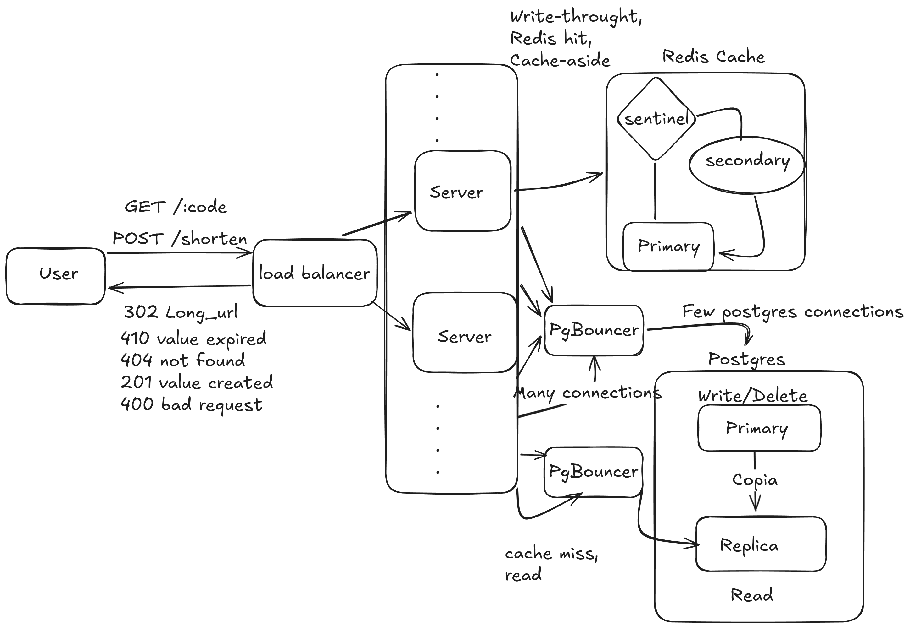

# URL Shortener — Design Document

> v1.0 · Redis + Postgres + Nginx · Base62 Encoding

---

## 1. Overview

The core challenge here is not storing URLs — it's serving redirects at high volume with low latency.

The service converts long URLs into short codes (e.g. `srt.ly/aB3xK2`), stores the mapping, and redirects users via HTTP 302. Redis sits in front of Postgres to handle the read-heavy workload. Requests are distributed across stateless app servers behind Nginx.

---

## 2. API Design

### Endpoints

| Method | Path | Status | Description |
|--------|------|--------|-------------|
| POST | `/shorten` | 201 Created | Creates a short URL |
| GET | `/:code` | 302 Found | Redirects to original URL |
| GET | `/:code` | 404 Not Found | Code does not exist |
| GET | `/:code` | 410 Gone | Code existed but has expired |
| DELETE | `/:code` | 204 No Content | Deletes a short URL (auth required) |

No API versioning in v1 — it can be added later without breaking existing clients.

404 vs 410 is intentional: 404 means the code never existed; 410 means it expired. Search engine crawlers de-index 410 links faster than 404.

### Request / Response Formats

**POST /shorten**
```json
// Request
{ "url": "https://some-very-long-url.com/path?query=value" }

// Response 201
{ "short_url": "https://srt.ly/aB3xK2", "code": "aB3xK2", "expires_at": null }

// Response 400
{ "error": "invalid_url", "message": "URL must start with http:// or https://" }
```

**GET /:code**
```
HTTP 302   Location: https://some-very-long-url.com/path?query=value
HTTP 404   { "error": "not_found", "message": "Code does not exist" }
HTTP 410   { "error": "expired", "message": "This link has expired" }
```

---

## 3. Short ID Generation

We convert the Postgres serial ID to Base62. Simple, collision-free, no coordination needed between servers.

### Base62 Encoding

```
Alphabet: 0-9 (10) + a-z (26) + A-Z (26) = 62 characters

6 chars → 62^6 = ~56 billion unique URLs
7 chars → 62^7 = ~3.5 trillion unique URLs
```

### Approach Tradeoffs

| Approach | Pros | Cons | Collision Handling |
|---|---|---|---|
| ID → Base62 | No collision, simple | Sequential = predictable IDs | None needed |
| MD5/SHA256 truncated | Deterministic, no DB round-trip | High collision rate when truncated | Retry with salt |
| Random 6 chars | Unpredictable, private | Collision possible at scale | Retry on duplicate key |
| UUID truncated | Simple | Highest collision rate | Retry loop |
| Snowflake ID | Distributed, non-sequential | Requires instance ID config | None needed |
| NanoID | Cryptographically random | Library dependency | Retry on duplicate key |

### Collision Handling

1. On `INSERT`, catch unique constraint violation
2. Retry up to 3 times with a new code
3. If all retries fail → return HTTP 503

---

## 4. Storage

### Architecture: Redis + Postgres



**Redis** — cache layer
- Serves >95% of reads at < 5ms
- Populated on every `/shorten` (write-through)
- TTL: 24h default
- Tracks click counts via atomic `INCR`
- Eviction policy: `allkeys-lru`
- High availability via Redis Sentinel (3 nodes minimum)

**Postgres** — source of truth
- All writes go to Primary
- Cache-miss reads go to Replica
- PgBouncer sits in front of both Primary and Replica for connection pooling

```
App Servers ──► PgBouncer ──► Postgres Primary  (writes)
App Servers ──► PgBouncer ──► Postgres Replica  (cache-miss reads)
```

Cache misses are rare (~5% of traffic) but a cold Redis under heavy load can send thousands of simultaneous connections to the Replica. Without pooling, that alone can overwhelm Postgres.

### v1 Infrastructure Footprint

```
Redis Primary   ┐
Redis Replica   ├── 3 nodes minimum (Sentinel needs quorum to failover)
Redis Sentinel  ┘

Postgres Primary  ┐
Postgres Replica  ┘── 2 nodes (read/write separation)

App servers (2+)
Nginx
```

A single Redis node is a single point of failure — one crash takes down 100% of redirects. A single Postgres node cannot handle a 1:100 write/read ratio at scale.

### Schema

```sql
CREATE TABLE urls (
    id          BIGSERIAL PRIMARY KEY,
    code        VARCHAR(10)  UNIQUE NOT NULL,
    long_url    TEXT         NOT NULL,
    created_at  TIMESTAMPTZ  DEFAULT NOW(),
    expires_at  TIMESTAMPTZ,           -- NULL = never expires
    user_id     BIGINT,                -- NULL = anonymous
    click_count BIGINT       DEFAULT 0
);

CREATE INDEX idx_urls_code    ON urls(code);
CREATE INDEX idx_urls_expires ON urls(expires_at) WHERE expires_at IS NOT NULL;
```

`long_url` uses `TEXT` — the 2048 char limit is enforced in the app, not the schema. The partial index on `expires_at` only covers rows that actually expire, keeping it small and fast.

### Why Redis + Postgres

- Redis keeps redirect latency under 5ms for 95%+ of traffic
- Postgres guarantees nothing is lost if Redis restarts or evicts data
- The Replica absorbs all reads, keeping the Primary free for writes
- PgBouncer prevents connection exhaustion with multiple app servers

---

## 5. Redirect Flow

```
GET /aB3xK2

1. Nginx receives request
   → rate limit: 100 req/min per IP
   → round-robin to one of the app servers

2. App server checks Redis
   → GET aB3xK2

3a. Cache HIT (>95% of traffic)
    → INCR clicks:aB3xK2
    → HTTP 302  Location: <long_url>

3b. Cache MISS
    → SELECT long_url, expires_at WHERE code = 'aB3xK2'  [Replica]
    → not found  → HTTP 404
    → expired    → HTTP 410
    → found:
        → SET aB3xK2 <long_url> EX 86400
        → INCR clicks:aB3xK2
        → HTTP 302  Location: <long_url>
```

The redirect always goes to the exact URL stored at creation — query parameters included. A link to `site.com/blog?blog_id=1` will always redirect there intact.

Query parameters added to the short URL itself (e.g. `srt.ly/aB3xK2?utm_source=twitter`) are ignored in v1. The stored URL is always the target, unchanged.

### 301 vs 302

**Always use 302.**

| | 301 Permanent | 302 Temporary |
|---|---|---|
| Browser caches | Forever — never hits server again | Never — always hits server |
| Analytics | Lost after first visit | Always tracked |
| Can update destination | No | Yes |
| Rate limiting | Bypassed after first visit | Always enforced |

The small latency cost of 302 is irrelevant with Redis in front. The loss of analytics from 301 is not acceptable.

---

## 6. Edge Cases

### Same URL Submitted Twice

Every request always generates a new code, even for duplicate URLs. This is intentional:

- Two users shortening the same URL should not share analytics
- A user may want separate links to track different campaigns
- No SELECT before INSERT — the write path stays simple

The tradeoff is duplicate entries accumulating over time. Storage is cheap and the indexed `code` column keeps queries fast regardless.

### Invalid URLs

Validated by a standard URL parser before touching the database:

- Must start with `http://` or `https://`
- Must have a valid hostname
- Max 2048 characters
- Percent-encoding must be well-formed — `%` must be followed by exactly two hex characters. Malformed sequences like `%off` are rejected. The parser normalizes unencoded characters (e.g. spaces → `%20`) without double-encoding sequences that are already encoded.

Returns HTTP 400 with a clear error message on failure.

### Link Expiration

1. **On read**: `expires_at < NOW()` → HTTP 410
2. **Daily cron**: `DELETE FROM urls WHERE expires_at < NOW()`
3. **Redis TTL**: set to `min(user_ttl, 86400)` — expired links are never served from cache

### Original URL Goes Down

Not our problem in v1. The service is a routing layer, not a content validator. URLs go down temporarily — deleting a link over a transient failure would be wrong. The owner of the link is responsible for the destination.

---

## 7. Scale

### 1 Million Concurrent Requests on One Link

This is the **thundering herd problem** — a traffic spike concentrated on a single resource.

- **Redis absorbs it**: handles 100k+ operations/sec per node, scales linearly with Redis Cluster
- **Stateless app servers**: any server can handle any request, add more behind Nginx with no config changes
- **Click counter via `INCR`**: atomic and non-blocking — no database locks under load
- **Nginx rate limiting**: blocks abusive traffic before it reaches the app

### Caching Strategy

| Strategy | Where | How |
|---|---|---|
| Write-through | `/shorten` | New URLs go to Redis immediately on creation |
| Cache-aside | `/:code` miss | App fetches from Postgres and populates Redis |
| TTL | Redis | 24h default, extendable for hot links |
| Eviction | Redis | `allkeys-lru` — least recently used keys removed when memory is full |

### CDN

A CDN (e.g. Cloudflare) in front of Nginx adds edge caching, DDoS protection, and global latency improvements.

Caveat: CDN-cached redirects bypass analytics. Use `Cache-Control: no-store` for links where click tracking matters.

### Read Replicas

Required. Reads outnumber writes 100:1. The Replica handles all cache-miss reads, keeping the Primary free for writes. A few milliseconds of replication lag is acceptable for redirects.

---

## 8. What We Are NOT Building in v1

| Feature | Why deferred |
|---|---|
| User authentication | Anonymous links prove the core model first |
| Custom aliases | Different collision space, needs its own reservation flow |
| Analytics dashboard | Click data already exists; the UI is a separate surface |
| Link previews | Requires external HTTP calls, adds latency |
| QR code generation | Frontend-only, zero backend changes needed |
| Bulk URL creation | Can be built on top of `POST /shorten` later |
| Query parameter passthrough | Changes redirect semantics; deferred to v2 |
| Destination health checks | Extra infra for unclear v1 value |
| Multi-region replication | CDN covers global latency for now |